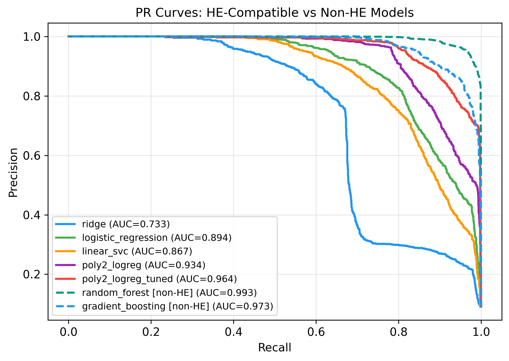
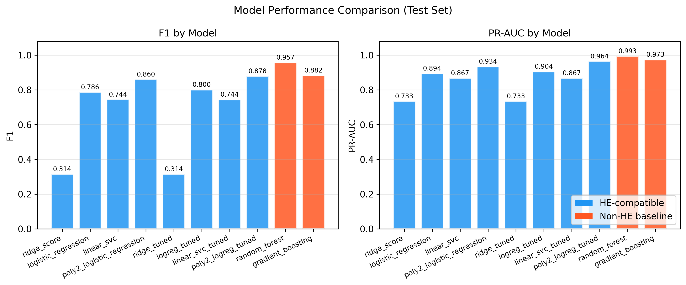
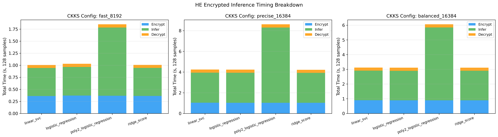
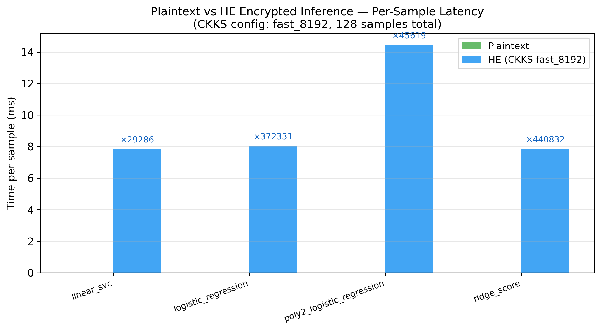

# Privacy-Preserving Fraud Detection with Homomorphic Encryption

> Course project for **Engineering Privacy in Software** (17-735 / 19-605 / 95-878) — Carnegie Mellon University, Spring 2026.

A prototype system for fraud detection on financial transactions that supports **encrypted inference** using the CKKS homomorphic encryption scheme (via [TenSEAL](https://github.com/OpenMined/TenSEAL)). Built on the [PaySim](https://www.kaggle.com/datasets/ealaxi/paysim1) synthetic financial dataset.

## Overview

This project demonstrates that linear and low-degree polynomial models trained on engineered features can achieve strong fraud detection performance (F1 ≈ 0.88) while remaining fully compatible with homomorphic encryption — allowing inference on **encrypted data without ever decrypting it**.

### Key Results (Test Set)

| Model | HE-Compatible | F1 | PR-AUC |
|---|:---:|---:|---:|
| Random Forest | No | 0.9566 | 0.9930 |
| Gradient Boosting | No | 0.8822 | 0.9731 |
| **Poly2 LogReg (C=10)** | **Yes** | **0.8782** | **0.9638** |
| LogReg (λ=0.01) | Yes | 0.7999 | 0.9042 |
| Linear SVC (C=10) | Yes | 0.7438 | 0.8671 |
| Ridge (α=0.01) | Yes | 0.3140 | 0.7335 |

`poly2_logreg_tuned` is the recommended model: best HE-compatible F1, and fast enough for interactive encrypted inference.

### Sample Figures

<table>
<tr>
<td></td>
<td></td>
</tr>
<tr>
<td></td>
<td></td>
</tr>
</table>

---

## Project Structure

```
.
├── fraud_baseline_6d.ipynb      # Step 1: training, sweep, grid search
├── he_inference_demo.ipynb      # Step 2: encrypted inference demo + timing
├── visualization.ipynb          # Step 3: poster-quality figures
│
├── src/
│   ├── config.py                # Shared constants & feature lists
│   ├── data.py                  # CSV loading, sampling, feature engineering
│   ├── models.py                # Custom Ridge / LogReg fitting
│   ├── evaluation.py            # evaluate_split(), HE eval subset selection
│   ├── he_utils.py              # CKKS context, encrypted scoring, batch runner
│   └── visualization.py        # All matplotlib/seaborn plotting
│
├── artifacts/
│   ├── *.pkl                    # Serialized models & scaler
│   ├── *.json                   # Metrics, grid search, timing results
│   ├── *.csv                    # Test scores, labels, HE eval subsets
│   └── figures/                 # Pre-generated PNG charts (300 DPI)
│
├── archive/
│   ├── baseline_6d_pipeline.py  # Standalone training script (no notebook)
│   └── baseline_model_artifacts_8d.json  # Prior 8D baseline for comparison
│
└── data/                        # ← NOT included (see Data section below)
    └── PS_20174392719_...csv    # PaySim CSV (471 MB) — download separately
```

---

## Setup

### Requirements

- [Anaconda](https://www.anaconda.com/) with a `prompt_engineering` conda environment
- Python 3.x, pandas, numpy, scipy, scikit-learn, tenseal, jupyter

> **Note:** TenSEAL installation outside conda is unreliable on macOS. Do **not** migrate to venv.

### Install

```bash
# Create the conda environment
conda create -n prompt_engineering python=3.11
conda activate prompt_engineering

# Install dependencies
pip install pandas numpy scipy scikit-learn tenseal jupyter
```

### Data

The raw PaySim dataset is not included in this repo (471 MB). Download it from Kaggle:

> [https://www.kaggle.com/datasets/ealaxi/paysim1](https://www.kaggle.com/datasets/ealaxi/paysim1)

Place the CSV at:
```
data/PS_20174392719_1491204439457_log.csv
```

---

## Running

Run notebooks in order:

```bash
conda activate prompt_engineering

# Step 1 — train all models, run ratio sweep + grid search, write artifacts/
jupyter nbconvert --to notebook --execute \
  --ExecutePreprocessor.kernel_name=prompt_engineering \
  fraud_baseline_6d.ipynb

# Step 2 — encrypted inference demo, HE timing results
jupyter nbconvert --to notebook --execute \
  --ExecutePreprocessor.kernel_name=prompt_engineering \
  he_inference_demo.ipynb

# Step 3 — poster-quality figures → artifacts/figures/
jupyter nbconvert --to notebook --execute \
  --ExecutePreprocessor.kernel_name=prompt_engineering \
  visualization.ipynb
```

Or interactively:
```bash
jupyter notebook
```

To run the training pipeline as a plain script (no notebook required):
```bash
python archive/baseline_6d_pipeline.py
```

---

## Approach

### Data Pipeline

```
Raw PaySim CSV (6.8M rows)
  → Filter: TRANSFER & CASH_OUT only (2.77M rows)
  → Stratified downsample: 10:1 non-fraud:fraud (~90K rows)
  → Feature engineering: deltaOrig, deltaDest, is_transfer
  → Train/Val/Test split: 57,598 / 14,400 / 18,000
  → StandardScaler (fit on training set) → 6D scaled features
  → 4 HE-compatible models + tuned variants
  → 2 non-HE upper-bound baselines (RandomForest, GradientBoosting)
```

### Feature Space

**6D base features (HE-friendly):**
`amount_scaled`, `oldbalanceOrg_scaled`, `oldbalanceDest_scaled`, `deltaOrig_scaled`, `deltaDest_scaled`, `is_transfer`

**27D polynomial features:** `PolynomialFeatures(degree=2, include_bias=False)` expansion of the 6D base, computed in plaintext before encryption.

### HE Inference Strategy

- **Linear models (Ridge, LogReg, LinearSVC):** encrypt 6D features once → evaluate weighted sums in CKKS-encrypted space
- **Poly2LogReg:** expand 6D→27D in plaintext first → encrypt → score — avoids expensive encrypted polynomial construction

**CKKS parameter configurations swept:**

| Config | `poly_modulus_degree` | Notes |
|---|---|---|
| `fast_8192` | 8192 | Fastest; avg decryption error < 1ms |
| `balanced_16384` | 16384 | Balanced |
| `precise_16384` | 16384 | Highest precision |

`fast_8192` is recommended for interactive demos.

---

## Artifacts

Pre-generated artifacts are included in `artifacts/` so notebooks 2 and 3 can run without retraining.

| File | Description |
|---|---|
| `scaler_6d.pkl` | Fitted StandardScaler |
| `poly2_logreg_tuned.pkl` | Best HE-compatible model |
| `poly2_transformer.pkl` | PolynomialFeatures transformer |
| `feature_order_6d.json` | Feature ordering (required for correct inference) |
| `extended_model_comparison.json` | All models — use for dashboard |
| `he_timing_results.json` | Per-model encrypt/infer/decrypt times |
| `test_scores_6d.csv` | Raw scores for all models on test set |
| `figures/` | Poster-quality PNG charts |

---

## Dashboard Integration

To build a frontend on top of this project (no retraining needed):

1. Load `artifacts/scaler_6d.pkl` + `artifacts/poly2_logreg_tuned.pkl`
2. Load `artifacts/feature_order_6d.json` for correct column ordering
3. **Plaintext inference:** apply scaler → compute score with model weights
4. **HE inference demo:** use `src/he_utils.py` → `build_ckks_context()` + `encrypted_linear_score()`
   - Recommend `fast_8192` config for interactive use
5. Use `artifacts/extended_model_comparison.json` for benchmark display
6. Use `artifacts/figures/` for pre-generated charts

---

## License

This project uses the [PaySim synthetic dataset](https://www.kaggle.com/datasets/ealaxi/paysim1) for research purposes.
